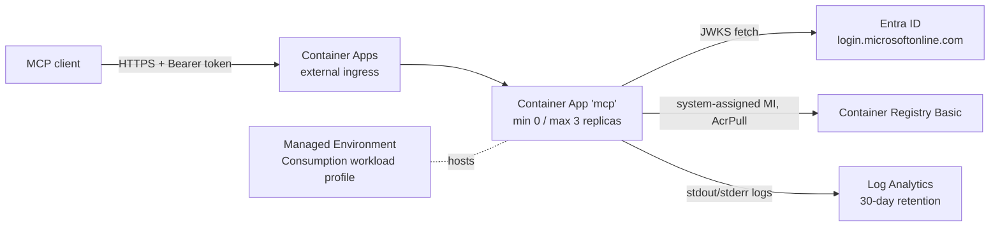

# Azure Deployment Plan — entra-oauth-mcp-server

> **Status:** Validated
>
> Phase 1 (analysis, recipe selection, architecture) is complete and **approved by the user**.
> Phase 2 (artifact generation) is complete.
> **azure-validate has been run and ALL checks pass** — see §7a. `azd` 1.34.0 and Docker Desktop 4.90 / engine 29.7.2 were
> installed with user permission, so the two previously blocked checks are now green: `azd provision --preview` succeeds and
> the container image builds and passes an in-container smoke test.
> **Nothing has been deployed.** The next step is the **azure-deploy** skill.

Generated: 2026-09-14

---

## 1. Project Overview

**Goal:** Deploy the existing TypeScript MCP server (Streamable HTTP, secured by Microsoft Entra ID bearer tokens) to Azure
on a low-cost, scale-to-zero footprint.

**Path:** **Modernize Existing** — the app exists and is fully tested; no application features are being added. Work is limited
to containerization + Azure infrastructure + configuration wiring.

---

## 2. Requirements

| Attribute | Value | Source |
|---|---|---|
| Classification | Development / POC-grade hosting | Inferred — single service, no SLA stated |
| Scale | Small (single service, bursty/low traffic) | Inferred |
| Budget | **Cost-Optimized** | Explicit user requirement ("low-cost") |
| **Subscription** | `yvand-mcaps` (`26508ee7-4aa7-4f59-9180-842360f2b153`) — **confirmed by user** | User instruction |
| **Location** | **francecentral** — **confirmed by user**, quota-validated | User instruction |

---

## 3. Components Detected

| Component | Type | Technology | Path |
|---|---|---|---|
| `mcp` | API (single service) | Node.js 24+, TypeScript 5.6 (ESM, NodeNext), Express 4, `@modelcontextprotocol/sdk` 1.30, `jose` 5 | `./` (root) |

**Codebase scan results**

| Aspect | Finding | Deployment impact |
|---|---|---|
| Entrypoint | `src/index.ts` → compiled `dist/index.js` | Container `CMD ["node","dist/index.js"]` |
| Build | `npm run build` (`tsc -p tsconfig.json`) | Needs devDependencies at build time → multi-stage Dockerfile |
| Listener | `app.listen(config.port, config.host)` | See binding note below |
| Port | `PORT` env, default `3000` | Ingress `targetPort` must match |
| **Host** | `HOST` env, **default `127.0.0.1`** | ⚠️ **Must set `HOST=0.0.0.0`** or the container accepts no external traffic |
| Health | `GET /healthz` (unauthenticated, returns 200 JSON) | Use directly as liveness/readiness probe path |
| State | **Stateless** — MCP transport runs in stateless mode, one server+transport per request | Safe to scale to zero and across replicas; no session affinity needed |
| Data stores | **None** | No DB, cache, or storage resources required |
| Secrets | **None** — the server only *validates* tokens; no client secret or certificate | No Key Vault required (see §5) |
| Outbound deps | Entra JWKS endpoint `login.microsoftonline.com` (HTTPS 443) | Default egress is sufficient |
| Config surface | `ENTRA_TENANT_ID`, `ENTRA_AUDIENCE`, `MCP_REQUIRED_SCOPE`, `ENTRA_ISSUER`, `ENTRA_JWKS_URI`, `PORT`, `HOST`, `PUBLIC_BASE_URL` | Becomes Bicep params → container env vars |
| Tests | Vitest, 26 passing; typecheck + build clean | Re-run in azure-validate |

---

## 4. Recipe Selection

**Selected: AZD (Azure Developer CLI) + Bicep** — per explicit user instruction, and it is also the skill's default.

**Rationale**
- Single containerized service → `azd up` handles build, ACR push, provision, and deploy in one workflow.
- `azd` resolves the ACR pull/identity link automatically (`az containerapp registry set --identity system`), avoiding the
  manual step the Bicep-only path requires.
- Bicep keeps us on first-party AVM modules with no extra state backend to manage (unlike Terraform).
- No existing `azure.yaml`, `*.tf`, or `infra/*.bicep` in the workspace, so there is no prior tooling to honor.

---

## 5. Architecture

**Stack: Containers → Azure Container Apps (Consumption).**

Chosen over App Service (better scale-to-zero economics), Functions (MCP Streamable HTTP is a long-lived HTTP server, not an
event-triggered function), and AKS (no Kubernetes API, CRD, or GPU requirements; far higher fixed cost).



### Service Mapping

| Component | Azure Service | SKU / Tier | Cost note |
|---|---|---|---|
| `mcp` API | Container Apps (Consumption) | 0.5 vCPU / 1 GiB, min 0 / max 3 | **Scale-to-zero → ~$0 when idle**; monthly free grant covers light use |
| Hosting env | Container Apps Managed Environment | Consumption workload profile | No fixed charge |
| Image storage | Azure Container Registry | **Basic** | Lowest-cost registry tier |
| Logs | Log Analytics workspace | PerGB2018, **30-day retention**, daily cap | Retention kept at the free 31-day floor; cap prevents bill surprises |

### Supporting Services — deliberate inclusions and exclusions

| Service | Decision | Rationale |
|---|---|---|
| Log Analytics | ✅ Include | Required by the managed environment; cost-conscious retention/cap |
| Managed Identity (system-assigned) | ✅ Include | ACR pull without registry admin credentials |
| Application Insights | ❌ **Exclude** (user-approved) | The app has no APM instrumentation and it adds ingestion cost against the "low-cost" requirement. Container Apps console/system logs land in Log Analytics. |
| Key Vault | ❌ **Exclude** (user-approved) | The server holds **no secrets** — it validates tokens and never requests them. All config (tenant ID, audience, scope, base URL) is non-sensitive. |

### Container App configuration

| Setting | Value | Why |
|---|---|---|
| Ingress | **External, HTTPS-only**, `transport: auto`, `allowInsecure: false` | Public MCP endpoint; Azure terminates TLS and provides the FQDN |
| `targetPort` | `3000` (Bicep param, matches `PORT`) | Matches app listener |
| Scale | **`minReplicas: 0`**, `maxReplicas: 3`, HTTP rule (~50 concurrent requests) | Explicit scale-to-zero requirement |
| Probes | Liveness + readiness → `GET /healthz` | Endpoint already exists and is unauthenticated |
| Identity | System-assigned, `AcrPull` on the registry | No admin user, no stored credentials |
| Resources | `cpu: json('0.5')`, `memory: '1Gi'` | Smallest balanced Consumption combination |
| Revision mode | Single | Simplest; no traffic-splitting need |

> **Cold-start trade-off (accepted):** `minReplicas: 0` means the first request after idle pays a container start
> (typically a few seconds). This is the direct cost of the scale-to-zero requirement. Raising `minReplicas` to 1 removes it
> but incurs continuous vCPU/memory charges.

### Application configuration parameters

Bicep parameters → container env vars. None are secrets.

| Bicep param | Env var | Value / source |
|---|---|---|
| `entraTenantId` | `ENTRA_TENANT_ID` | **User-supplied** (Entra directory ID) |
| `entraAudience` | `ENTRA_AUDIENCE` | **User-supplied** (`api://<api-client-id>`, comma-separated list allowed) |
| `mcpRequiredScope` | `MCP_REQUIRED_SCOPE` | Default `mcp.invoke` |
| `entraIssuer` *(optional)* | `ENTRA_ISSUER` | Empty → app derives from tenant ID |
| `entraJwksUri` *(optional)* | `ENTRA_JWKS_URI` | Empty → app derives from tenant ID |
| — | `PORT` | `3000` |
| — | `HOST` | **`0.0.0.0`** (required in-container) |
| — | `NODE_ENV` | `production` |
| `publicBaseUrl` | `PUBLIC_BASE_URL` | See chicken-and-egg note below |

> **`PUBLIC_BASE_URL` ordering constraint:** this value feeds the RFC 9728 protected-resource metadata document and the
> `WWW-Authenticate: resource_metadata=` hint, and it must be the **public HTTPS ingress FQDN** — which Azure only assigns
> chicken-and-egg problem: the ingress FQDN is **deterministic** once the managed environment exists, because it is
> `<app-name>.<environment default domain>`. `main.bicep` therefore builds `PUBLIC_BASE_URL` as
> `https://${containerAppName}.${containerAppsEnvironment.outputs.defaultDomain}` — correct metadata after a single
> `azd up`, with no second pass. Supplying the `publicBaseUrl` parameter overrides it for a custom domain.

### AVM module plan (Bicep)

Selection follows the mandatory AVM order — **pattern → resource → utility**. No AVM *pattern* module covers this exact
ACA + ACR + Log Analytics shape, so we drop to **AVM resource modules**:

| Purpose | AVM resource module | Pinned version |
|---|---|---|
| Log Analytics workspace | `avm/res/operational-insights/workspace` | **0.16.1** |
| Container Registry | `avm/res/container-registry/registry` | **0.13.0** |
| Container Apps Environment | `avm/res/app/managed-environment` | **0.16.0** |
| Container App | `avm/res/app/container-app` | **0.23.0** |

> Versions were pinned from live MCR registry tag metadata
> (`https://mcr.microsoft.com/v2/bicep/avm/res/<module>/tags/list`) and are the latest published at generation time.
> The resource group is created with a **native** `Microsoft.Resources/resourceGroups` resource rather than an AVM module —
> a plain RG needs no module abstraction and this avoids an extra version to track.
> The `AcrPull` role assignment is a **separate local module** (`infra/modules/acr-pull-role.bicep`) consuming the container
> app's principal ID, per the skill's mandated two-phase pattern, which avoids a circular dependency between the app and the
> registry. `main.bicep` uses `targetScope = 'subscription'` and tags the resource group `azd-env-name`; the container app
> carries `azd-service-name: mcp`.

---

## 6. Provisioning Limit Checklist

**Scope validated:** subscription `yvand-mcaps` (`26508ee7-4aa7-4f59-9180-842360f2b153`), region **francecentral**.

### Resource Inventory with Quota Validation ✅ COMPLETE (francecentral)

| Resource Type | Number to Deploy | Current Usage | Total After Deployment | Limit/Quota | Notes |
|---|---|---|---|---|---|
| `Microsoft.Resources/resourceGroups` | 1 | 35 | 36 | 980 | Fetched from: `az group list` + Official docs (ARM subscription limits) |
| `Microsoft.App/managedEnvironments` | 1 | 0 | 1 | 50 | Fetched from: azure-quotas (`ManagedEnvironmentCount`, **francecentral**, usage + limit both retrieved) |
| `Microsoft.App/containerApps` (Consumption vCPU) | 1 app × 0.5 vCPU × max 3 replicas = **1.5 cores** | 0 | 1.5 | 2000 | Fetched from: azure-quotas (`SandboxCores`, **francecentral**). No per-subscription *count* quota exists for containerApps; Consumption capacity is governed by this cores quota. |
| `Microsoft.ContainerRegistry/registries` (Basic) | 1 | 0 | 1 | No documented per-subscription cap | Fetched from: Azure Resource Graph (no registries exist in this subscription) + Official docs (quota API returns `BadRequest` for this provider). Basic SKU constrains storage (10 GiB included), not registry count. |
| `Microsoft.OperationalInsights/workspaces` | 1 | 9 in francecentral (12 subscription-wide) | 10 in francecentral | No documented cap on PerGB2018 (the 10-workspace cap applies to the legacy Free tier only) | Fetched from: Azure Resource Graph + Official docs (quota API returns `BadRequest` for this provider) |

**Status:** ✅ **All resources within limits.** Largest utilization is resource groups at 36/980 (≈3.7%). Container Apps
consumption is 1.5 of 2000 cores (<0.1%).

**Method notes**
- Azure CLI **2.88.0**; `quota` and `resource-graph` extensions installed.
- `Microsoft.Quota` resource provider was **not registered** on this subscription; registered it (`az provider register
  --namespace Microsoft.Quota`) to enable quota lookups. Registration is additive and non-destructive.
- The quota API intermittently returns `MissingRegistrationForResourceProvider` even while the provider reports
  `Registered`; the francecentral values above were captured after retrying with backoff.
- `Microsoft.ContainerRegistry` and `Microsoft.OperationalInsights` return `BadRequest` from the quota API (unsupported
  providers), so the documented fallback — Azure Resource Graph counts + official service-limit docs — was used. This is a
  limitation of the quota API, not an unperformed check.

> ⚠️ **Local tooling status:** `azd` **1.34.0** and **Docker Desktop 4.90 (engine 29.7.2)** are installed and working.
> Both were used during validation (§7a). `azd` needs `AZURE_TENANT_ID` set as a process environment variable on this
> machine due to a multi-tenant Azure CLI sign-in — see the note in §7a.

---

## 7. Execution Checklist

### Phase 1: Planning
- [x] Analyze workspace (mode: Modernize Existing)
- [x] Gather requirements
- [x] Scan codebase
- [x] Select recipe (AZD + Bicep)
- [x] Plan architecture (ACA Consumption, scale-to-zero)
- [x] Prepare resource inventory (§6 Phase 1)
- [x] Write `.azure/deployment-plan.md` to workspace root
- [x] **User approved this plan**
- [x] Detect Azure context — subscription `yvand-mcaps`; region **francecentral** (✅ both confirmed by the user)
- [x] Fetch quotas and validate capacity (azure-quotas) — ✅ all within limits in francecentral

### Phase 2: Execution ✅ COMPLETE
- [x] Research components; pin AVM module versions (from live MCR tag metadata)
- [x] Generate `Dockerfile` (multi-stage, node:24-alpine, non-root, prod-only deps)
- [x] Generate `.dockerignore`
- [x] Generate `azure.yaml` (`host: containerapp`, service `mcp`)
- [x] Generate `infra/main.bicep`, `infra/main.parameters.json`, `infra/modules/*.bicep`
- [x] Wire `HOST=0.0.0.0` + config params as container env vars
- [x] Apply security hardening (HTTPS-only ingress, system-assigned MI, ACR admin user disabled)
- [x] Functional verification (see §7a — Docker unavailable, so the runtime stage was simulated natively)
- [x] Update plan status to `Ready for Validation`
- [ ] Hand off to **azure-validate** (never run `azd up` directly from azure-prepare)

### Phase 3: Validation ✅ COMPLETE
- [x] **PREREQUISITE:** Plan status was `Ready for Validation`
- [x] Invoke azure-validate skill
- [x] **All validation checks pass** — see §7a
  - [x] `azd version` — 1.34.0 installed
  - [x] `azd provision --preview --no-prompt` succeeds
  - [x] `docker build` + `azd package --no-prompt` succeed
  - [x] In-container smoke test: non-root, `HOST=0.0.0.0`, `/healthz` 200, `/mcp` 401/405
  - [x] `az bicep build` (0 errors, 0 warnings) and `az deployment sub what-if` (`Succeeded`, no drift)
  - [x] `npm run typecheck`, `npm test` (26/26), `npm run build` pass
  - [x] Azure Policy check — no `Deny` effects
  - [x] Static RBAC review — `AcrPull`, registry-scoped, least privilege
- [x] Update plan status to `Validated`
- [x] Record validation proof in §7a

### Phase 4: Deployment
- [ ] Invoke azure-deploy skill
- [ ] Deployment successful
- [ ] Report deployed endpoint URL (ingress FQDN)
- [ ] Update plan status to `Deployed`

---

## 7a. Validation Proof

> **Status of validation: ✅ COMPLETE — all checks pass. Plan status set to `Validated`.**
> `azd` 1.34.0 and Docker Desktop 4.90 (engine 29.7.2) were installed with explicit user permission, clearing the two
> previously blocked checks.

### Checks executed by azure-validate

| Check | Command Run | Result | Timestamp |
|-------|-------------|--------|-----------|
| 1. AZD installation | `winget install Microsoft.Azd`; `azd version` | ✅ **Pass** — `azd version 1.34.0 (stable)`. Note: azd was *already* installed at `%LOCALAPPDATA%\Programs\Azure Dev CLI`; the earlier "not installed" finding was a **PATH** issue, not a missing tool. | 2026-09-14 |
| 2. azure.yaml schema | `azd package` parsed `azure.yaml` and resolved service `mcp`; fields verified: `name`, `services.mcp`, `host: containerapp`, `language: ts`, `docker.path` | ✅ **Pass** | 2026-09-14 |
| 3. Environment setup | `azd env new mcp-dev --subscription 26508ee7-… --location francecentral` | ✅ **Pass** — env created and set as default | 2026-09-14 |
| 4. Authentication | `azd config set auth.useAzCliAuth true`; `azd auth login --check-status` | ✅ **Pass** — `Logged in to Azure as admin@MngEnvMCAP743237.onmicrosoft.com` | 2026-09-14 |
| 5. Subscription / location | `azd env get-values` → `AZURE_SUBSCRIPTION_ID`, `AZURE_LOCATION=francecentral`; quota validated in §6 | ✅ **Pass** | 2026-09-14 |
| 6. Aspire pre-provisioning | n/a — not a .NET Aspire project | ⏭️ Skipped | 2026-09-14 |
| 7. **Provision preview** | `azd provision --preview --no-prompt` | ✅ **Pass** — `SUCCESS: Generated provisioning preview`. Plan: **Create** resource group `rg-mcp-dev`, Container Registry `cr73ym7xy7k6m32`, Log Analytics workspace `log-73ym7xy7k6m32`. Corroborated by `az deployment sub what-if` → `status: Succeeded`, `error: null`, **identical resource set (no drift)**. | 2026-09-14 |
| 8. Build verification | `az bicep build`; `npm run typecheck`; `npm run build`; `npm test` | ✅ **Pass** — bicep exit 0 / 0 errors / 0 warnings; typecheck exit 0; build exit 0; **26 of 26 tests passed** | 2026-09-14 |
| 9. Docker build context | Dockerfile uses `npm ci`; verified `package-lock.json` exists at the build-context root | ✅ **Pass** | 2026-09-14 |
| 10. **Package validation** | `docker build -t entra-oauth-mcp-server:validate .` then `azd package --no-prompt` | ✅ **Pass** — image built (exit 0); azd tagged `entra-oauth-mcp-server/mcp-mcp-dev:azd-deploy-…`, `SUCCESS: Your application was packaged for Azure` | 2026-09-14 |
| 11. Azure Policy validation | `az policy assignment list --disable-scope-strict-match`, then inspected each definition's effect | ✅ **Pass** — 4 assignments, all ASC/Defender **audit/monitoring**; **no `Deny` effects** that could block ACA, ACR or Log Analytics | 2026-09-14 |
| 12. Aspire post-provisioning | n/a — not a .NET Aspire project | ⏭️ Skipped | 2026-09-14 |

**Validated by:** azure-validate
**Validation timestamp:** 2026-09-14

> **Multi-tenant auth gotcha (resolved, and it will recur for `azd up`):** with `auth.useAzCliAuth`, `azd` enumerates *every*
> tenant the Azure CLI is signed into. This machine's CLI holds accounts in several tenants, one of which fails token
> acquisition, so azd aborted with `listing tenants: … AzureCLICredential: exit status 1` — even though
> `az account get-access-token` worked fine. **Fix:** set `AZURE_TENANT_ID=3989f541-267c-4dcf-94f1-98a4d20d2b23` as a
> *process* environment variable before invoking azd, which makes it read the subscription/tenant directly and skip
> enumeration. Setting it only via `azd env set` was **not** sufficient. Apply the same variable in azure-deploy.

### In-container verification (real image, not a native reproduction)

Image built from the generated `Dockerfile`, run as a container with the same environment variables Bicep supplies.
Container: `docker run -d -p 3312:3000 -e ENTRA_TENANT_ID=<placeholder> -e ENTRA_AUDIENCE=<placeholder> -e MCP_REQUIRED_SCOPE=mcp.invoke -e PUBLIC_BASE_URL=https://ca-mcp-example.francecentral.azurecontainerapps.io`

| Check | Command | Result |
|---|---|---|
| Image builds | `docker build` | ✅ exit 0, multi-stage build completed |
| Container starts | `docker ps` | ✅ `Up`, `0.0.0.0:3312->3000/tcp` |
| **Runs as non-root** | `docker exec … id` | ✅ `uid=1000(node) gid=1000(node)` — confirms the `USER node` directive |
| **`HOST=0.0.0.0` in effect** | `docker exec … printenv HOST PORT NODE_ENV` | ✅ `0.0.0.0` / `3000` / `production` |
| **Binds non-loopback** | `docker logs` | ✅ `MCP server listening on http://0.0.0.0:3000/mcp` |
| **devDependencies absent** | `docker exec … test -d node_modules/typescript` / `vitest` | ✅ neither present — the `--omit=dev` runtime stage is correct |
| Health probe path | `curl http://127.0.0.1:3312/healthz` | ✅ **200** `{"status":"ok","server":"entra-oauth-mcp-server","version":"1.0.0"}` |
| Protected-resource metadata | `curl .../.well-known/oauth-protected-resource` | ✅ **200**, `scopes_supported` = `api://…/mcp.invoke`, issuer derived from tenant |
| Unauthenticated MCP call | `curl -X POST .../mcp` (no token) | ✅ **401**, JSON-RPC `-32001`, `WWW-Authenticate` carrying `resource_metadata` |
| Invalid token rejected | `curl -X POST .../mcp -H "Authorization: Bearer not.a.jwt"` | ✅ **401**, `Invalid access token: JWS Protected Header is invalid` |
| Wrong method | `curl .../mcp` (GET) | ✅ **405**, JSON-RPC `-32000` |
| Malformed body stays JSON | `curl -X POST .../mcp -d 'NOT-JSON'` | ✅ **401** JSON-RPC (auth runs before body parsing — no HTML error page) |

Test container and image were removed afterwards (`docker rm -f` / `docker rmi -f`).

**Three design decisions confirmed against the real image**
1. `HOST=0.0.0.0` overrides the app's `127.0.0.1` default — the container genuinely accepts external traffic.
2. `PUBLIC_BASE_URL` propagates into both the metadata document and the `WWW-Authenticate` hint, exactly as the
   Bicep-derived ingress FQDN will in Azure.
3. The non-root `USER node` step and the production-only dependency closure both behave as intended.

### Role Assignment Verification (static code review)

- **Status:** ✅ Verified
- **Identities checked:** the `mcp` container app's **system-assigned managed identity** (the only identity created).
- **Roles confirmed:** `AcrPull` (`7f951dda-4ed3-4680-a7ca-43fe172d538d`), assigned in
  `infra/modules/acr-pull-role.bicep`, **scoped to the container registry resource only** — not the resource group or
  subscription. This matches the app's sole platform-level data operation: pulling its own image.
- **Least privilege:** ✅ `AcrPull` is the pull-only data-plane role; `AcrPush` / `Contributor` are deliberately not used.
  ACR admin user is disabled (`acrAdminUserEnabled: false`), so the managed identity is the only pull path.
- **Missing roles:** none. The application code touches **no Azure data services** — it only fetches the public Entra JWKS
  endpoint over HTTPS, which needs no Azure RBAC. There is no storage, database, queue or Key Vault access to grant.
- **Issues found:** none.

> **Note on what-if short-circuiting:** the managed environment, container app and AcrPull nested deployments report
> `NestedDeploymentShortCircuited`. This is expected ARM behavior — those modules take parameters derived from
> `reference()` outputs of resources that do not exist yet, so what-if skips them. It is a **warning, not an error**; both
> `azd provision --preview` and `az deployment sub what-if` completed successfully, and `az bicep build` fully type-checked
> every module, including all four AVM modules, against their pinned versions.

### 7b. Post-validation incident: real `azd provision` failure and fix (2026-09-15)

A subsequent actual provision run, **`mcp-dev-1789463522`** (subscription `26508ee7-4aa7-4f59-9180-842360f2b153`,
`rg-mcp-dev`), failed. `az deployment operation sub list` / `az deployment operation group list` pinpointed **two**
distinct failures the earlier what-if preview had not caught, because both are backend/ARM-side validations that
`--preview`/what-if do not fully replicate for resources whose parameters depend on not-yet-created siblings:

| # | Failing resource | ARM error code | Message |
|---|---|---|---|
| 1 | `Microsoft.ContainerRegistry/registries/cr73ym7xy7k6m32` | `NetworkRuleNotSupported` | "The requested feature virtual network rule is not supported for the SKU Basic." |
| 2 | `Microsoft.Resources/deployments/cae-73ym7xy7k6m32` (managed environment) | `ManagedEnvironmentInvalidNetworkConfiguration` | "ZoneRedundant must be disabled if InfrastructureSubnetId is not provided." |

**Root cause 1 (ACR):** in the pinned `avm/res/container-registry/registry:0.13.0` source, the internal variable
`shouldConfigureNetworkRuleSet` is `true` whenever `networkRuleSetIpRules != null` **or**
(`publicNetworkAccess == 'Enabled'` **and** `networkRuleSetDefaultAction == 'Deny'`). `main.bicep` set
`publicNetworkAccess: 'Enabled'` but never overrode `networkRuleSetDefaultAction`, whose module default is `'Deny'`. That
combination made the module emit a `networkRuleSet: { defaultAction: 'Deny', ipRules: [] }` property on the ACR resource
— and Basic-tier ACR rejects the `networkRuleSet` property outright, even with no actual IP/VNet rules inside it. This
was never exercised by `what-if`/`az bicep build` because template type-checking doesn't call the ACR RP's runtime
validation.

**Fix 1:** added one parameter to the `containerRegistry` module in `infra/main.bicep`:
`networkRuleSetDefaultAction: 'Allow'`. This makes the module's own condition false, so it omits the `networkRuleSet`
property entirely (there is no explicit "disabled" flag in the module's interface — omission is the only way to avoid
it). SKU stays **Basic**; no upgrade to Standard/Premium was needed or made.

**Root cause 2 (environment):** `avm/res/app/managed-environment:0.16.0` defaults `zoneRedundant` to `true`. Zone
redundancy requires the environment to be deployed into a customer VNet subnet (`infrastructureSubnetResourceId`), which
this low-cost architecture deliberately does not use. Without a subnet, ARM rejects `zoneRedundant: true` at actual
creation time — a check `what-if` does not perform for this nested deployment (it was already short-circuited per the
note above, so no diagnostic ever surfaced it).

**Fix 2:** added `zoneRedundant: false` to the `containerAppsEnvironment` module in `infra/main.bicep`. This has no cost
or availability implication for a single-region, non-VNet Consumption deployment — the environment was already
effectively non-zone-redundant by construction.

Both fixes are additive parameters only; no module version, SKU, or architectural component changed.

**Re-validation after the fix:**

| Check | Command | Result |
|---|---|---|
| Bicep compiles | `az bicep build --file infra\main.bicep` | ✅ exit 0, 0 errors |
| No drift / ACR plan clean | `az deployment sub what-if --location francecentral --template-file infra\main.bicep --parameters environmentName=mcp-dev location=francecentral ...` | ✅ `Succeeded`. ACR resource plan now shows **no `networkRuleSet` property at all**; only `1 to create` (ACR), `2 no change` (resource group, Log Analytics — already present from the earlier partial run) |
| Provision preview (real CLI, real tenant) | `AZURE_TENANT_ID=3989f541-267c-4dcf-94f1-98a4d20d2b23 azd provision --preview --no-prompt` | ✅ `SUCCESS: Generated provisioning preview` — plans `Create: Container Registry cr73ym7xy7k6m32`; `Skip: rg-mcp-dev`, `Skip: log-73ym7xy7k6m32` (both already exist from the failed run) |
| App still green | `npm run typecheck`; `npx vitest run` | ✅ typecheck exit 0; **26/26 tests passed** |

No `azd up`, `azd deploy`, or non-preview `azd provision` was run. Nothing was deployed as part of this fix.


## 8. Files Generated (Phase 2 ✅ complete)

| File | Purpose | Status |
|---|---|---|
| `.azure/deployment-plan.md` | This plan | ✅ |
| `Dockerfile` | Multi-stage container build (node:24-alpine, non-root `node` user) | ✅ |
| `.dockerignore` | Excludes `node_modules`, `dist`, `.env`, `infra`, `test` from build context | ✅ |
| `azure.yaml` | azd service definition (`mcp`, `host: containerapp`) | ✅ |
| `infra/main.bicep` | Subscription-scope entry point, AVM modules | ✅ |
| `infra/main.parameters.json` | ARM JSON params with `${AZURE_ENV_NAME}` substitutions | ✅ |
| `infra/modules/acr-pull-role.bicep` | AcrPull role assignment (separate, breaks the circular dependency) | ✅ |
| `infra/modules/fetch-container-image.bicep` | Preserves the deployed image across re-provisions | ✅ |
| `README.md` | Added section 5, "Deploy to Azure" | ✅ |

No application source file was changed — `HOST=0.0.0.0` is supplied as an environment variable, so `src/` is untouched.

---

## 9. Assumptions

1. **Cost beats cold-start.** `minReplicas: 0` is used as instructed; first request after idle is slower.
2. **Development-grade.** No zone redundancy, no multi-region, no WAF/Front Door, single revision.
3. **Public endpoint.** External ingress open to the internet; the Entra bearer-token check is the only authorization layer
   (which is the app's design). No IP restrictions or Private Link.
4. **Entra app registrations already exist** (or the user will create them per the README). Infra does **not** create them —
   Entra registrations are Graph objects, not ARM resources.
5. **No Key Vault / App Insights** — justified in §5; easily added if the user wants them.
6. **ACR Basic is adequate** (single small image, no geo-replication).
7. **Default Azure-assigned FQDN** (`*.azurecontainerapps.io`) is acceptable; no custom domain or certificate.
8. **Node 24-alpine base image** for a small attack surface; the app requires Node ≥ 24.
9. **`azd` 1.34.0 and Docker Desktop (engine 29.7.2) are installed** and were used to validate the artifacts. Note that
   `azd` requires `AZURE_TENANT_ID` as a *process* environment variable on this machine, because the Azure CLI is signed
   into multiple tenants (see §7a).
10. **Entra parameters default to placeholder GUIDs** (`00000000-...` / `api://00000000-...`) so the infrastructure can be
    provisioned before the registrations exist. The app *requires* these variables to be non-empty at startup, so
    placeholders keep the container booting; it will reject **every** token until real values are set.
11. **First provision uses a public placeholder image.** No image exists in the registry until `azd deploy` pushes one, so
    `main.bicep` starts from `containerapps-helloworld` and `fetch-container-image.bicep` preserves the real image on
    subsequent provisions. Custom `/healthz` probes are attached only once the app exists (`mcpExists`), so the placeholder
    revision cannot fail probes that its image does not serve.

---

## 10. Azure Context Inputs

| Input | Why it is needed | Status |
|---|---|---|
| **Azure subscription** (name + ID) | Deployment target; scopes every quota lookup | ✅ **Confirmed:** `yvand-mcaps` (`26508ee7-4aa7-4f59-9180-842360f2b153`) |
| **Azure region** | Resource location; must support ACA + ACR + Log Analytics | ✅ **Confirmed: francecentral**, quota-validated (see §6) |
| **`azd` CLI** | Required by the selected recipe to run `azd up` | ✅ **Installed** — `azd version 1.34.0` |
| **Docker** | Required by `azd` to build the container image | ✅ **Installed** — Docker Desktop 4.90, engine 29.7.2, running |
| **`ENTRA_TENANT_ID`** | Runtime token validation (issuer/JWKS) | ⚠️ Placeholder default in Bicep; set via `azd env set ENTRA_TENANT_ID <id>` |
| **`ENTRA_AUDIENCE`** | Expected `aud` claim | ⚠️ Placeholder default in Bicep; set via `azd env set ENTRA_AUDIENCE api://<id>` |
| `MCP_REQUIRED_SCOPE` | Required delegated scope | Defaults to `mcp.invoke` |
| `PUBLIC_BASE_URL` | OAuth metadata / `WWW-Authenticate` hint | Auto-derived from the environment's default domain; override only for a custom domain |
| Environment name | `azd` env + resource naming | Suggest `mcp-dev` |

> ⚠️ **The placeholder Entra values let the infrastructure deploy and the container start, but `/mcp` will reject every
> token until real values are supplied.** This is deliberate: it decouples provisioning from Entra administration.

---

## 11. Next Steps

> Current phase: **✅ Validated. Ready for azure-deploy. Nothing has been deployed.**

1. *(Optional but recommended)* Set the real Entra values before deploying, so the server can serve traffic immediately:
   ```
   azd env set ENTRA_TENANT_ID <your-tenant-id>
   azd env set ENTRA_AUDIENCE  api://<your-api-client-id>
   ```
   Bicep defaults to placeholder GUIDs, so provisioning works without them, but `/mcp` will reject **every** token until
   they are real.
2. Invoke **azure-deploy** to run `azd up`.
   ⚠️ **Set `AZURE_TENANT_ID=3989f541-267c-4dcf-94f1-98a4d20d2b23` as a process environment variable first** — see the
   multi-tenant note in §7a, or azd will fail with `listing tenants: AzureCLICredential: exit status 1`.
3. After deployment, add the printed ingress URL as a redirect URI on the Entra *client* registration.
4. Verify the live endpoint: `curl $SERVICE_MCP_URI/healthz` and
   `curl $SERVICE_MCP_URI/.well-known/oauth-protected-resource`.
